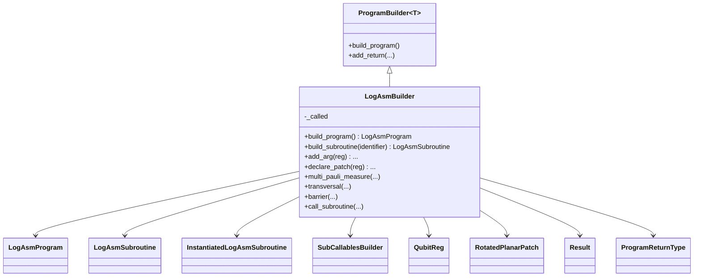

```mermaid
classDiagram
    class ProgramBuilder~T~ {
        +build_program()
        +add_return(...)
    }

    class LogAsmBuilder {
        -_called
        +build_program() LogAsmProgram
        +build_subroutine(identifier) LogAsmSubroutine
        +add_arg(reg) ...
        +declare_patch(reg) ...
        +multi_pauli_measure(...)
        +transversal(...)
        +barrier(...)
        +call_subroutine(...)
    }

    class LogAsmProgram
    class LogAsmSubroutine
    class InstantiatedLogAsmSubroutine
    class QubitReg
    class RotatedPlanarPatch
    class Result
    class ProgramReturnType
    class SubCallablesBuilder

    ProgramBuilder <|-- LogAsmBuilder
    LogAsmBuilder --> LogAsmProgram
    LogAsmBuilder --> LogAsmSubroutine
    LogAsmBuilder --> InstantiatedLogAsmSubroutine
    LogAsmBuilder --> SubCallablesBuilder
    LogAsmBuilder --> QubitReg
    LogAsmBuilder --> RotatedPlanarPatch
    LogAsmBuilder --> Result
    LogAsmBuilder --> ProgramReturnType
```
