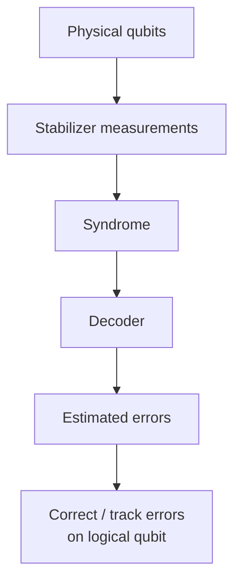

# Operational Flow

- Physical qubits: Qubits storing the encoded logical information
- Stabilizer measurements: Measure parity/check operators without directly measuring the logical state
- Syndrome: Results of those checks, indicating that errors may have occurred
- Decoder: Analyses the syndrome
- Estimated errors: Decoder determines the most likely error pattern
- Apply a correction, or track it classically, to preserve the logical state.

"track it classically": keep track of it and account for it later. TODO: check this term: Pauli-frame tracking
