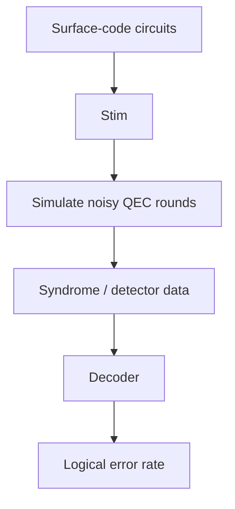

# Simulation Flow

- Surface-code circuits: Quantum circuits implementing the surface code and its error-checking measurements. 
- Stim: High-performance simulator for quantum stabilizer circuits.
- Simulate noisy QEC rounds: Run repeated error-correction cycles while introducing simulated physical errors.
- Syndrome / detector data: Measurement results indicating where errors may have occurred.
- Decoder: Analyses the syndrome data and estimates the most likely errors.
- Logical error rate: Measures how often the QEC system fails to preserve the logical information.

code: method
surface-code: encodes qubits on 2D lattice
stabilizer: error checks
